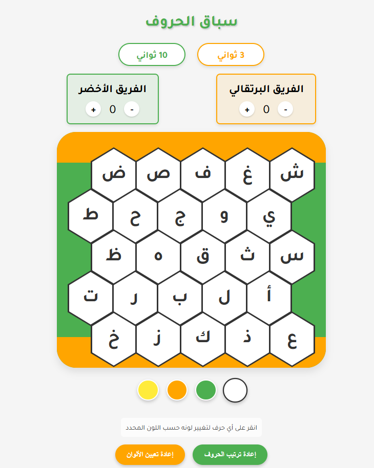

# 🎮 سباق الحروف  - لعبة تعليمية ممتعة

 <!-- استبدل هذا برابط صورة من اللعبة -->

لعبة تفاعلية تعليمية ممتعة باللغة العربية، تهدف إلى تعليم الحروف العربية بطريقة مسلية باستخدام أشكال سداسية ملونة.

## ✨ مميزات اللعبة

- واجهة مستخدم جذابة بتصميم عصري
- نظام نقاط للفريقين (الفريق الأخضر والفريق البرتقالي)
- مؤقت تنازلي (3 ثواني و10 ثواني)
- إمكانية تغيير ألوان الخلايا السداسية
- إعادة ترتيب الحروف عشوائياً
- تصميم متجاوب يعمل على مختلف أحجام الشاشات
- خط عربي أنيق (Tajawal من جوجل)

## 🛠 التقنيات المستخدمة

- HTML5
- CSS3 (Flexbox, Clip-path للشكل السداسي)
- JavaScript (ES6)
- Google Fonts (Tajawal)

## 🎯 كيفية اللعب

1. اختر لوناً من لوحة الألوان
2. انقر على أي حرف لتغيير لونه
3. استخدم المؤقتات لتنظيم وقت الجولة
4. عدل النقاط للفريقين باستخدام أزرار + و -
5. استخدم زر "إعادة ترتيب الحروف" لخلط اللوحة
6. استخدم زر "إعادة تعيين الألوان" لمسح الألوان
